# IITRAM Alumni Portal

> A production-grade, full-stack alumni networking platform for the Institute of Infrastructure, Technology, Research and Management (IITRAM), Ahmedabad. Built with a Hybrid RBAC + PBAC + ABAC Authorization framework, real-time messaging, and a modular enterprise architecture.

---

## 📸 Application Screenshots

### Login Page
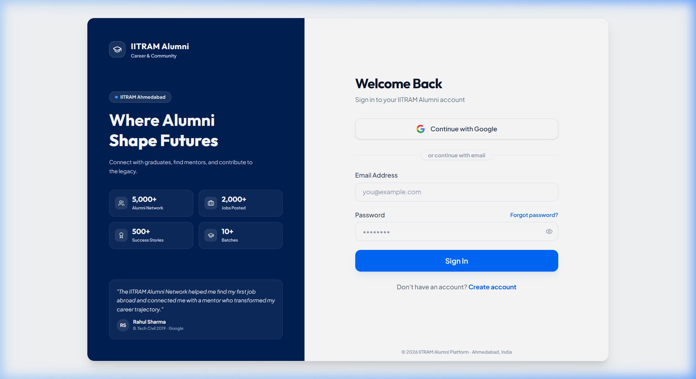

### Community Feed
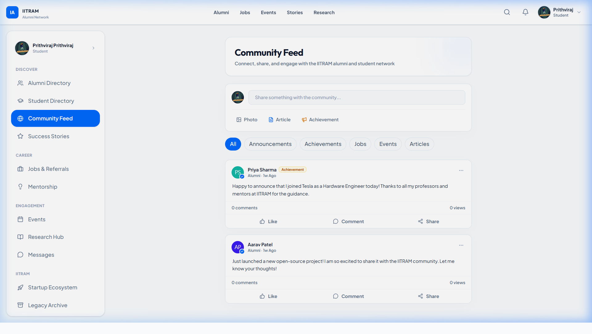

### Jobs & Opportunities
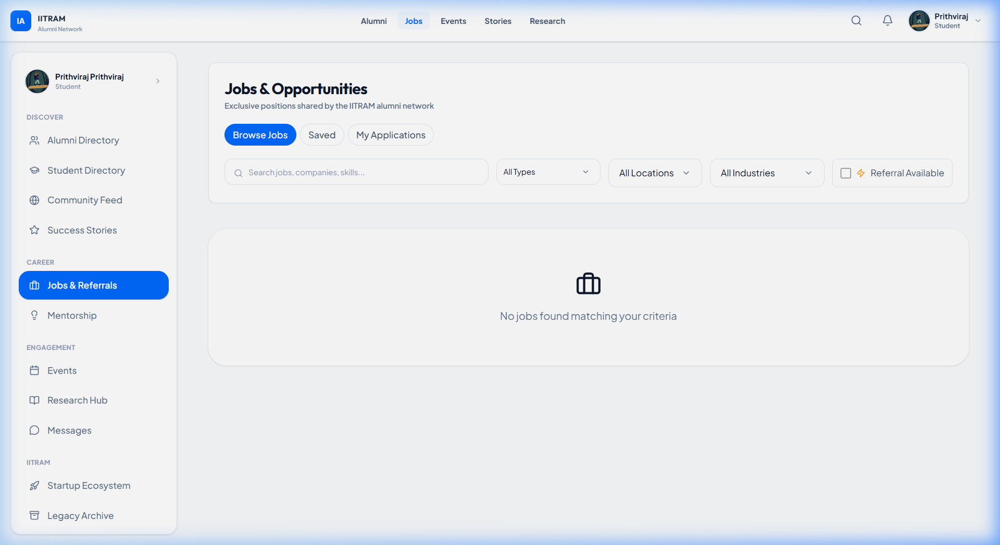

### Events
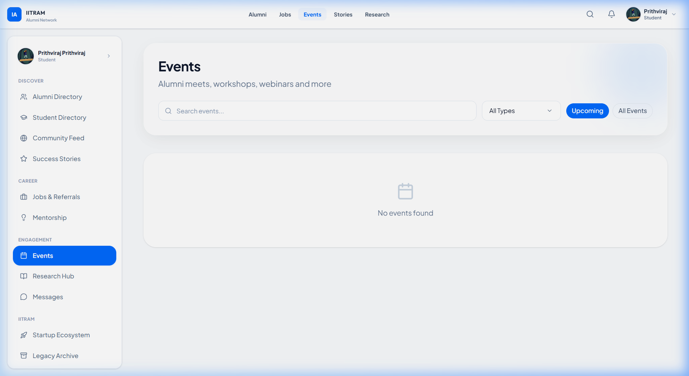

### Mentorship
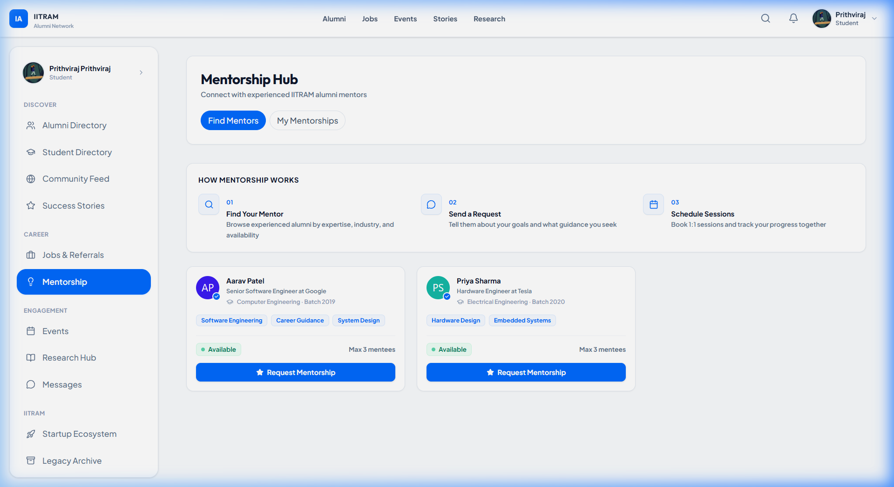

### Success Stories
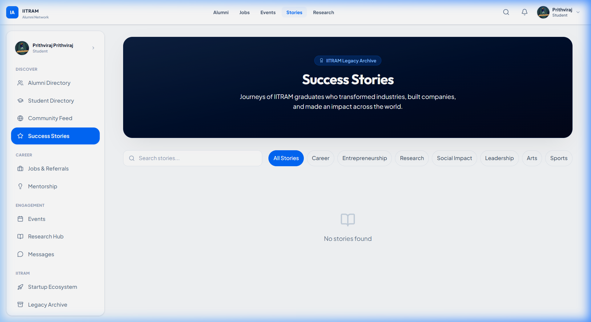

### Research Hub
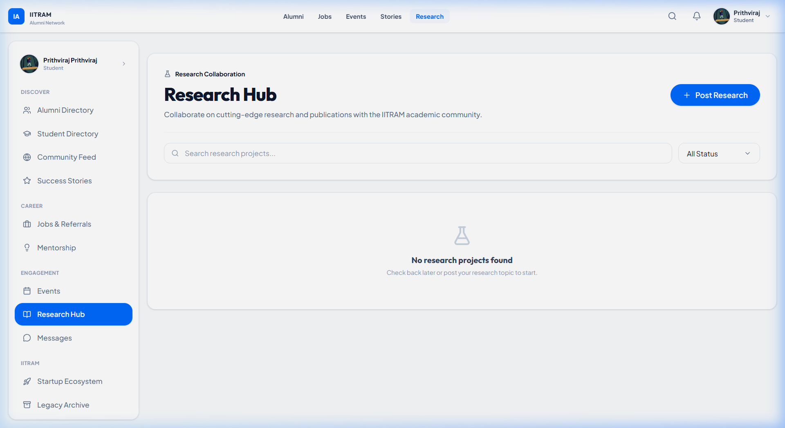

### Startup Ecosystem
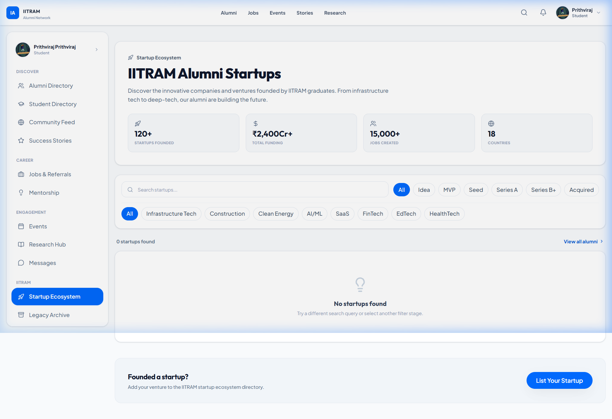

### Alumni Directory
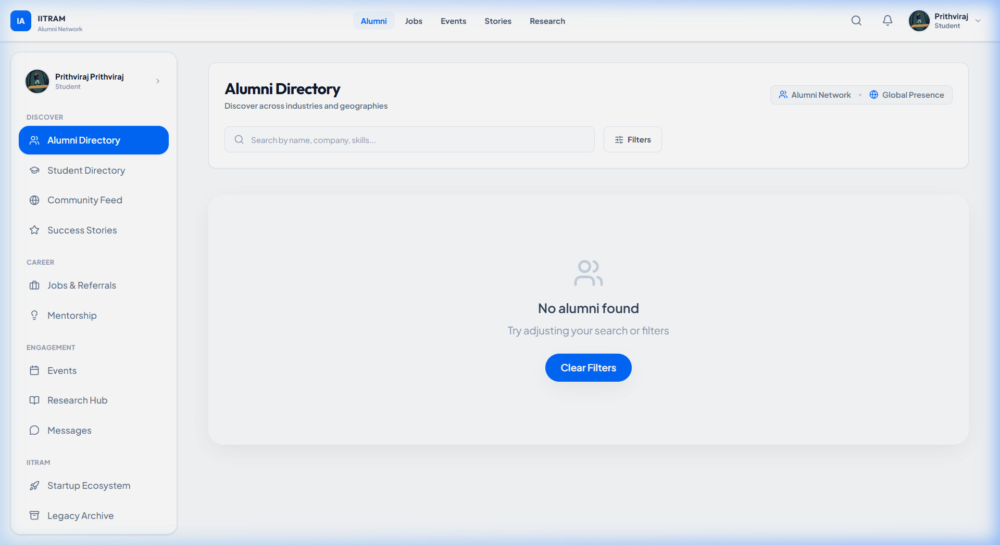

### Messages
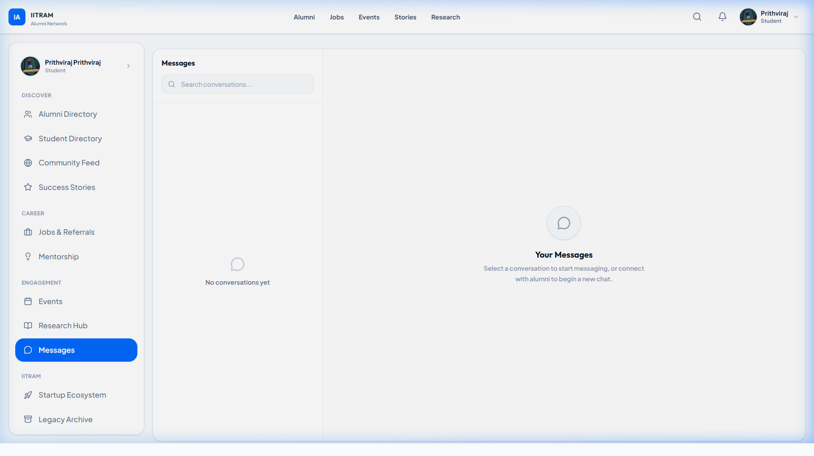

### Profile
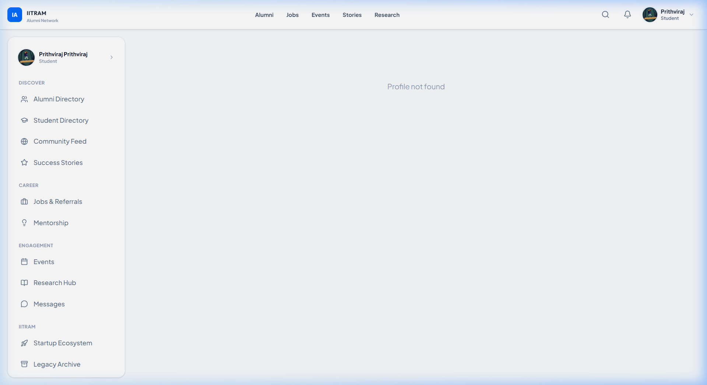

---

## 🏗️ System Architecture

```
┌─────────────────────────────────────────────────────────────────────┐
│                        CLIENT LAYER                                 │
│  React + TypeScript + Vite + TailwindCSS + Zustand + React Query    │
│  ┌──────────────────────────────────────────────────────────────┐   │
│  │  AuthorizationContext  →  PermissionGuard  →  ProtectedRoute │   │
│  └──────────────────────────────────────────────────────────────┘   │
└────────────────────────────┬────────────────────────────────────────┘
                             │ HTTPS / WebSocket
┌────────────────────────────▼────────────────────────────────────────┐
│                        API GATEWAY LAYER                            │
│  Express.js + Helmet + CORS + Rate Limiter + Morgan                 │
│  ┌─────────────────────────────────────────────────────────────┐    │
│  │  JWT Auth → requirePermission → requirePolicy → Controller  │    │
│  └─────────────────────────────────────────────────────────────┘    │
└──────────────────────────┬──────────────────────────────────────────┘
                           │
       ┌───────────────────┴───────────────────┐
       │                                       │
┌──────▼───────┐                    ┌──────────▼──────────┐
│ Authorization │                   │   Socket.io Layer   │
│    Engine     │                   │  Real-time Messaging│
│ RBAC+PBAC    │                   │  Notifications      │
│ +ABAC+Flags  │                   └─────────────────────┘
└──────┬───────┘
       │
┌──────▼────────────────────────────────────────────────────────────┐
│                       SERVICE LAYER                                │
│  Policies: Job │ Event │ Feed │ Research │ Story │ Mentor │ Report │
└──────┬────────────────────────────────────────────────────────────┘
       │
┌──────▼────────────────────────────────────────────────────────────┐
│                       DATA LAYER                                   │
│  MongoDB Atlas + Mongoose ODM                                      │
│  Collections: User │ Job │ Event │ Post │ Comment │ Message        │
│              Mentorship │ Research │ SuccessStory │ AuditLog       │
│              Report │ FeatureFlag │ Notification │ Connection      │
└───────────────────────────────────────────────────────────────────┘
```

---

## 🔐 Enterprise Authorization System (Hybrid RBAC + PBAC + ABAC)

### Role Hierarchy

| Role | Level | Verification Required | Key Capabilities |
|---|---|---|---|
| **Guest** | 0 | No | View public pages only |
| **Student** | 1 | No | Browse, apply to jobs, register for events, community feed |
| **Alumni** | 2 | ✅ Yes | Post jobs, create events, mentorship, success stories |
| **Faculty** | 2 | ✅ Yes | Create events, mentorship, research projects |
| **Admin** | 3 | System | Full access, moderation, verification, feature flags |

### Authorization Engine Architecture

```
AuthorizationEngine.can(user, action, resource?)
         │
         ├─ 1. Admin Bypass Check → if role=admin, allow all
         │
         ├─ 2. Account Status Check → if suspended, deny all
         │
         ├─ 3. Feature Flag Check → if module disabled, deny
         │
         ├─ 4. Permission Registry Check (RBAC)
         │      └─ config/permissions/ → role maps to allowed actions
         │
         ├─ 5. Verification Status Check (ABAC)
         │      └─ Mutating actions require verificationStatus='verified'
         │
         └─ 6. Resource Policy Check (PBAC)
                └─ Ownership OR Admin → policies/JobPolicy, EventPolicy, etc.
```

### Permission Namespaces

| Namespace | Actions | Who |
|---|---|---|
| `users:` | view, verify, delete, ban, edit_any | admin |
| `feed:` | create, edit_own, delete_own, delete_any | student+ |
| `comment:` | create, delete_own, delete_any | student+ |
| `job:` | create, apply, edit_own, delete_own, edit_any | alumni+ |
| `event:` | create, register, edit_own, delete_own | alumni+ |
| `research:` | create, apply, approve, edit_any | faculty+/admin |
| `story:` | create, edit_own, delete_own, approve | alumni+ |
| `startup:` | create, edit_own, delete_own | alumni+ |
| `mentor:` | enable, accept, reject, manage | alumni+/faculty |
| `report:` | create, review | student+/admin |
| `admin:` | panel_access, audit_log_view, feature_flag_manage | admin |

### Page Access Matrix

| Page | Guest | Student | Alumni | Faculty | Admin |
|---|---|---|---|---|---|
| Home / Landing | ✅ | ✅ | ✅ | ✅ | ✅ |
| Alumni Directory | ✅ | ✅ | ✅ | ✅ | ✅ |
| Student Directory | ✅ | ✅ | ✅ | ✅ | ✅ |
| Community Feed | ❌ | ✅ | ✅ | ✅ | ✅ |
| Post to Feed | ❌ | ✅ | ✅ | ✅ | ✅ |
| Browse Jobs | ✅ | ✅ | ✅ | ✅ | ✅ |
| **Post a Job** | ❌ | ❌ | ✅ (verified) | ❌ | ✅ |
| Apply to Job | ❌ | ✅ | ✅ | ✅ | ✅ |
| Browse Events | ✅ | ✅ | ✅ | ✅ | ✅ |
| **Create Event** | ❌ | ❌ | ✅ (verified) | ✅ (verified) | ✅ |
| Mentorship | ❌ | ✅ | ✅ | ✅ | ✅ |
| **Offer Mentorship** | ❌ | ❌ | ✅ (verified) | ✅ (verified) | ✅ |
| Success Stories | ✅ | ✅ | ✅ | ✅ | ✅ |
| **Write a Story** | ❌ | ❌ | ✅ (verified) | ❌ | ✅ |
| Research Hub | ✅ | ✅ | ✅ | ✅ | ✅ |
| **Post Research** | ❌ | ❌ | ✅ (verified) | ✅ (verified) | ✅ |
| Startup Ecosystem | ❌ | ✅ | ✅ | ✅ | ✅ |
| Messages | ❌ | ✅ | ✅ | ✅ | ✅ |
| Analytics | ❌ | ✅ | ✅ | ✅ | ✅ |
| **Admin Dashboard** | ❌ | ❌ | ❌ | ❌ | ✅ |

### Verification Lifecycle

```
PENDING ──► UNDER_REVIEW ──► VERIFIED
                │
                └──► REJECTED ──► (re-submit) ──► UNDER_REVIEW
                │
                └──► SUSPENDED (admin action)
```

---

## 📊 Data Flow

### Authentication Flow
```
User → Login Page
  → Google OAuth / Email+Password
  → Backend: POST /api/auth/login or /api/auth/google
  → JWT Access Token + Refresh Token issued
  → Frontend: Zustand authStore persisted to localStorage
  → AuthorizationContext loads Feature Flags
  → App renders role-appropriate navigation
```

### Request Authorization Flow
```
API Request with Bearer JWT
  → protect() middleware → verify JWT → attach req.user
  → requirePermission('action') → AuthorizationEngine.can()
      → Check: Admin bypass? Feature flag disabled? Account suspended?
      → Check: Role has this permission?
      → Check: Mutating action + not verified? → 403
  → requirePolicy('action', 'Model', 'idParam')
      → Fetch resource from DB, attach to req.resource
      → Check: resource.deletedAt exists + not admin? → 404
      → Is user owner? OR has _any permission? → allow/deny
  → Controller executes, logs audit entry
```

### Real-time Messaging Flow
```
User sends message → POST /api/messages/conversations/:id/messages
  → AuthorizationEngine checks 'message:start' (requires relationship)
  → Message saved to MongoDB
  → Socket.io emits 'new_message' to all participants
  → Frontend updates conversation in real-time
```

---

## 🛠️ Technology Stack

### Backend
| Layer | Technology |
|---|---|
| Runtime | Node.js 20 |
| Framework | Express.js + TypeScript |
| Database | MongoDB Atlas + Mongoose |
| Authentication | JWT (Access + Refresh tokens) + Passport.js |
| OAuth | Google OAuth 2.0 |
| Real-time | Socket.io |
| File Uploads | Cloudinary via Multer |
| API Docs | Swagger UI (`/api-docs`) |
| Security | Helmet, CORS, Rate Limiter, bcrypt |

### Frontend
| Layer | Technology |
|---|---|
| Framework | React 18 + TypeScript + Vite |
| Styling | TailwindCSS + custom design system |
| State | Zustand (auth) + TanStack React Query (server) |
| Routing | React Router v6 |
| Animations | Framer Motion |
| Icons | Lucide React |
| Notifications | React Hot Toast |

---

## 📁 Project Structure

```
Alumni/
├── backend/
│   └── src/
│       ├── config/
│       │   ├── permissions/     # Modular permission registries per domain
│       │   ├── roles/           # Role-to-permission mapping tables
│       │   ├── database.ts
│       │   ├── passport.ts      # Google OAuth strategy
│       │   └── swagger.ts       # OpenAPI spec
│       ├── middleware/
│       │   ├── auth.ts          # JWT protect() + optionalAuth()
│       │   ├── authorization.ts # requirePermission / requirePolicy / requireVerified
│       │   ├── errorHandler.ts
│       │   └── rateLimiter.ts
│       ├── models/
│       │   ├── User.ts          # + verificationStatus, privacySettings, softDelete
│       │   ├── Job.ts           # + JobStatus lifecycle, softDelete
│       │   ├── Event.ts         # + EventStatus lifecycle, softDelete
│       │   ├── Post.ts          # + softDelete audit fields
│       │   ├── ResearchProject.ts
│       │   ├── SuccessStory.ts
│       │   ├── Mentorship.ts
│       │   ├── Connection.ts
│       │   ├── Message.ts
│       │   ├── Notification.ts
│       │   ├── AuditLog.ts      # System audit trail
│       │   ├── Report.ts        # Content moderation reports
│       │   └── FeatureFlag.ts   # Dynamic module toggles
│       ├── services/
│       │   ├── AuthorizationEngine.ts   # Central permission resolver
│       │   ├── socketService.ts
│       │   └── policies/
│       │       ├── BasePolicy.ts
│       │       ├── JobPolicy.ts
│       │       ├── EventPolicy.ts
│       │       ├── FeedPolicy.ts
│       │       ├── ResearchPolicy.ts
│       │       ├── StoryPolicy.ts
│       │       ├── StartupPolicy.ts
│       │       ├── MentorshipPolicy.ts
│       │       ├── MessagingPolicy.ts
│       │       └── ReportPolicy.ts
│       ├── routes/
│       │   ├── auth.routes.ts
│       │   ├── user.routes.ts
│       │   ├── job.routes.ts       # Policy middleware integrated
│       │   ├── event.routes.ts     # Policy middleware integrated
│       │   ├── post.routes.ts      # Policy middleware integrated
│       │   ├── research.routes.ts  # Policy middleware integrated
│       │   ├── successStory.routes.ts
│       │   ├── mentorship.routes.ts
│       │   ├── message.routes.ts
│       │   ├── verification.routes.ts  # NEW: verification queue
│       │   ├── reports.routes.ts       # NEW: moderation reports
│       │   ├── auditLogs.routes.ts     # NEW: audit log explorer
│       │   └── featureFlags.routes.ts  # NEW: feature flag management
│       ├── controllers/
│       ├── utils/
│       │   └── auditLogger.ts     # Async audit event recorder
│       └── scripts/
│           └── migration.ts       # DB backfill for new schema fields
│
└── frontend/
    └── src/
        ├── config/
        │   └── permissions.ts     # Frontend permission mirror (const maps)
        ├── contexts/
        │   └── AuthorizationContext.tsx  # Feature flags + permission resolver
        ├── components/
        │   ├── auth/
        │   │   └── guards.tsx     # ProtectedRoute, PermissionGuard, VerificationRequiredPage
        │   └── layout/
        │       ├── Sidebar.tsx    # Permission-driven nav rendering
        │       └── Navbar.tsx
        ├── stores/
        │   └── authStore.ts       # Zustand: user + tokens + verificationStatus
        ├── pages/
        │   ├── admin/Admin.tsx    # Command Center: verifications, reports, logs, flags
        │   ├── auth/              # Login, Register, ForgotPassword, OAuth Callback
        │   ├── community/Feed.tsx
        │   ├── jobs/
        │   ├── events/
        │   ├── mentorship/
        │   ├── stories/
        │   ├── research/
        │   ├── startups/
        │   ├── messages/
        │   ├── profile/
        │   ├── alumni/
        │   ├── students/
        │   ├── analytics/
        │   └── legacy/
        └── App.tsx                # Route definitions with ProtectedRoute guards
```

---

## 🔌 API Reference

Full interactive API documentation is available at: **`http://localhost:5000/api-docs`**

### Auth Endpoints
| Method | Path | Description |
|---|---|---|
| POST | `/api/auth/register` | Register new account |
| POST | `/api/auth/login` | Email/password login |
| GET | `/api/auth/google` | Google OAuth initiation |
| GET | `/api/auth/google/callback` | Google OAuth callback |
| POST | `/api/auth/refresh` | Refresh access token |
| POST | `/api/auth/logout` | Invalidate session |

### Core Resource Endpoints
| Method | Path | Auth | Permission |
|---|---|---|---|
| GET | `/api/jobs` | Optional | — |
| POST | `/api/jobs` | Required | `job:create` + verified |
| PUT | `/api/jobs/:id` | Required | `job:update` (owner/admin) |
| DELETE | `/api/jobs/:id` | Required | `job:delete` (owner/admin) |
| POST | `/api/jobs/:id/apply` | Required | `job:apply` |
| GET | `/api/events` | Optional | — |
| POST | `/api/events` | Required | `event:create` + verified |
| GET | `/api/posts` | Optional | — |
| POST | `/api/posts` | Required | `feed:create` |
| POST | `/api/posts/:id/comments` | Required | `comment:create` |
| GET | `/api/research` | Optional | — |
| POST | `/api/research` | Required | `research:create` + verified |
| GET | `/api/success-stories` | Optional | — |
| POST | `/api/success-stories` | Required | `story:create` + verified |
| GET | `/api/mentorship` | Required | — |
| POST | `/api/mentorship/request` | Required | authenticated |

### Admin / Management Endpoints
| Method | Path | Permission |
|---|---|---|
| GET | `/api/verification/queue` | `users:verify` |
| POST | `/api/verification/submit` | authenticated |
| POST | `/api/verification/review/:userId` | `users:verify` |
| GET | `/api/reports` | `report:review` |
| POST | `/api/reports` | authenticated |
| POST | `/api/reports/:id/action` | `report:review` |
| GET | `/api/audit-logs` | `admin:audit_log_view` |
| GET | `/api/feature-flags` | authenticated |
| POST | `/api/feature-flags/toggle` | `admin:feature_flag_manage` |
| GET | `/api/admin/dashboard` | admin role |

---

## 🗃️ Database Schema

### User Model (Key Fields)
```typescript
{
  firstName, lastName, email, password, googleId,
  role: 'student' | 'alumni' | 'faculty' | 'admin',
  verificationStatus: 'pending' | 'under_review' | 'verified' | 'rejected' | 'suspended',
  verificationDocuments: string[],
  verificationHistory: [{ status, updatedBy, notes, updatedAt }],
  mentorStatus: 'inactive' | 'active' | 'suspended',
  privacySettings: { email, phone, company, linkedin, resume, socialLinks },
  deletedAt, deletedBy, deletionReason,       // Soft delete
  isBanned, banReason, isActive,
}
```

### Resource Lifecycle States
| Model | Status Values |
|---|---|
| Job | `draft` → `published` → `closed` → `archived` |
| Event | `draft` → `published` → `ongoing` → `completed` → `cancelled` |
| SuccessStory | `draft` → `pending_review` → `published` → `archived` |
| ResearchProject | `draft` → `open` → `applications_closed` → `completed` → `archived` |

### AuditLog Model
```typescript
{
  actor: ObjectId (User),
  action: string,           // e.g. 'USER_VERIFY', 'REPORT_RESOLVE'
  resource: string,         // Model name
  resourceId: string,
  previousValues: object,
  newValues: object,
  changedFields: string[],
  reason: string,
  ipAddress: string,
  userAgent: string,
  timestamp: Date,
}
```

---

## ⚙️ Environment Setup

### Prerequisites
- Node.js 20+
- MongoDB Atlas account (or local MongoDB)
- Google OAuth credentials (Cloud Console)
- Cloudinary account (for file uploads)

### Backend Setup
```bash
cd backend
npm install
cp .env.example .env
# Fill in .env values (see below)
npm run dev
```

### Frontend Setup
```bash
cd frontend
npm install
cp .env.example .env
# Set VITE_API_URL=http://localhost:5000/api
npm run dev
```

### Backend Environment Variables
```env
PORT=5000
NODE_ENV=development
MONGODB_URI=mongodb+srv://<user>:<password>@cluster.mongodb.net/alumni
JWT_SECRET=your-jwt-secret-min-32-chars
JWT_REFRESH_SECRET=your-refresh-secret-min-32-chars
JWT_EXPIRE=15m
JWT_REFRESH_EXPIRE=7d
GOOGLE_CLIENT_ID=your-google-client-id
GOOGLE_CLIENT_SECRET=your-google-client-secret
GOOGLE_CALLBACK_URL=http://localhost:5000/api/auth/google/callback
CLIENT_URL=http://localhost:5173
CLOUDINARY_CLOUD_NAME=your-cloud-name
CLOUDINARY_API_KEY=your-api-key
CLOUDINARY_API_SECRET=your-api-secret
```

### Database Migration (run once after setup)
```bash
cd backend
npx ts-node src/scripts/migration.ts
```
This backfills `verificationStatus`, `privacySettings`, and lifecycle `status` fields on all existing documents.

---

## 🚀 Running the Application

```bash
# Terminal 1 — Backend API
cd backend && npm start
# Server at http://localhost:5000
# Swagger UI at http://localhost:5000/api-docs

# Terminal 2 — Frontend Dev Server
cd frontend && npm run dev
# App at http://localhost:5173
```

---

## 🛡️ Security Features

| Feature | Implementation |
|---|---|
| JWT Auth | Access (15m) + Refresh (7d) token rotation |
| Password Hashing | bcryptjs with salt rounds |
| Rate Limiting | express-rate-limit on all `/api/` routes |
| CORS | Whitelisted origin only |
| Helmet | HTTP security headers |
| Soft Deletion | Resources flagged `deletedAt` — never hard-deleted |
| Audit Logging | All admin/destructive actions persisted to `AuditLog` |
| Verification Gate | Mutating actions blocked for unverified accounts |
| Account Suspension | `suspended` status = all API access denied |
| Feature Flags | Module-level toggles storable in DB, evaluated per request |

---

## 🔧 Admin Dashboard Features

The admin dashboard at `/admin` provides:

1. **Overview** — Platform stats, system health indicators, quick-action buttons
2. **Verification Queue** — Review submitted documents, approve/reject with notes
3. **Moderation Reports** — Process abuse reports, delete content, ban users
4. **Audit Logs** — Searchable, paginated log of all sensitive system actions
5. **Feature Flags** — Toggle platform modules on/off in real-time

---

## 📡 Real-time Features (Socket.io)

| Event | Description |
|---|---|
| `new_message` | Delivered to conversation participants on new message |
| `notification` | Pushed on connection requests, job applications, mentions |
| `online_status` | User presence tracking |

---

## 🧪 Build Verification

```bash
# Backend TypeScript check
cd backend && npx tsc --noEmit   # ✅ 0 errors

# Frontend TypeScript + Vite build
cd frontend && npm run build     # ✅ Built in ~1.5s, 0 errors

# Database migration
cd backend && npx ts-node src/scripts/migration.ts
# ✅ 6 users, 2 events, 2 stories migrated
```

---

## 📄 License

This project is developed for IITRAM (Institute of Infrastructure, Technology, Research and Management), Ahmedabad. All rights reserved © 2026.

---

*Built with ❤️ for the IITRAM alumni community — connecting minds, building futures.*
