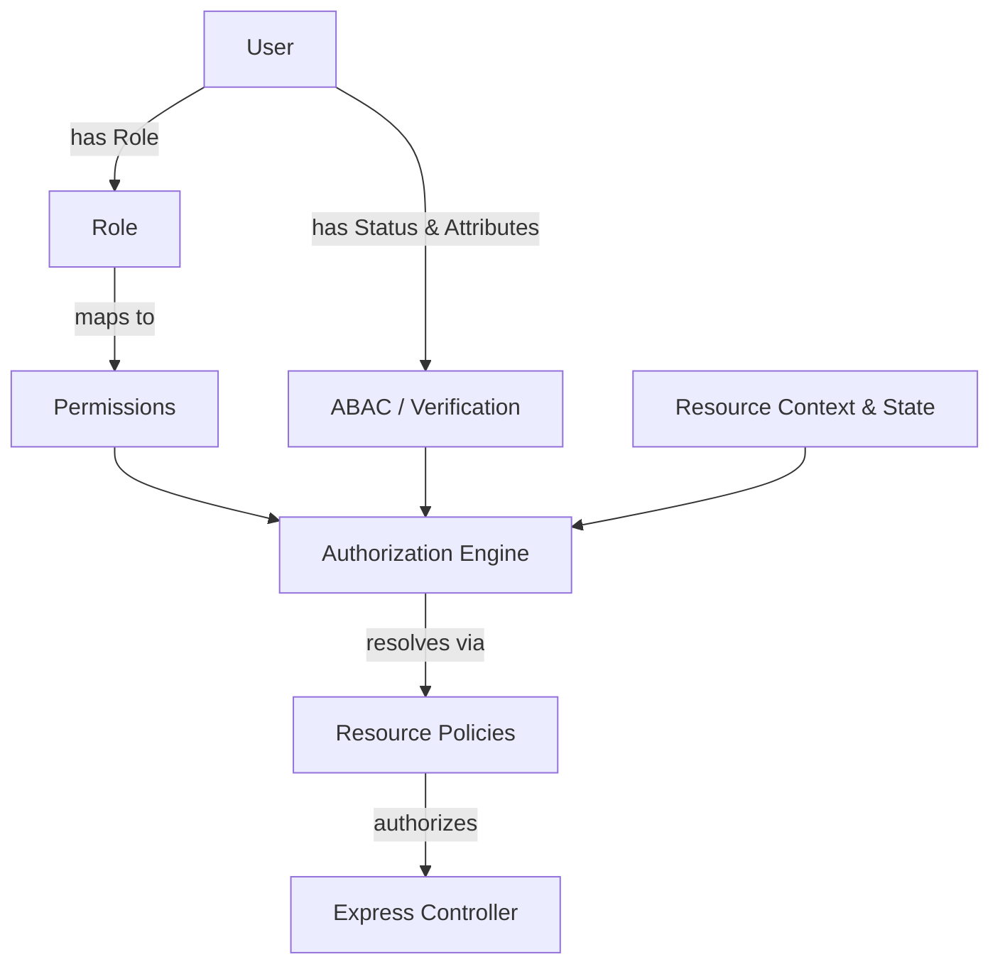

# Proposal: Enterprise Authorization Framework (RBAC + PBAC + ABAC)

We will migrate the IITRAM Alumni Portal to an enterprise-grade, policy-driven Hybrid Authorization Framework (supporting Role-Based, Permission-Based, and Attribute-Based Access Control). This framework matches the authorization quality of platforms like GitHub, Microsoft Teams, and LinkedIn.

---

## Architectural Enhancements

### 1. Hybrid Policy Engine & ABAC
We will decouple authorization from Express controllers using a centralized `AuthorizationEngine` and dedicated `ResourcePolicy` classes. The engine will evaluate decisions based on the user's role, permissions list, verification status, and dynamic resource properties (such as resource state, ownership, application deadlines, and networking statuses).

### 2. Centralized Policy Definitions
Policies will govern access for each module. For instance, the `JobPolicy` will dictate:
* `apply(user, job)`: Returns true if user is verified, job state is `'open'`, deadline is not expired, and the user hasn't already applied.
* `update(user, job)`: Returns true if user is the job owner or holds the `*` permission.

### 3. Verification & Privacy Lifecycle
We will upgrade user verification statuses: `pending` ➔ `under_review` ➔ `verified` ➔ `rejected` ➔ `suspended`. The system will support profile field privacy settings (`Public`, `College Only`, `Connections Only`, `Private`) to dynamically filter query responses based on connection statuses.

### 4. Soft Delete & Audit Logging
Major schemas will support soft delete markers (`deletedAt`, `deletedBy`, `deletionReason`). Sensitive mutations (banning, verifying, resolving reports, toggling feature flags) will register audit logs recording actor details, previous values, and new values.

---

## Proposed Changes



### Backend Structure

#### [NEW] [permissions](file:///d:/projects/Alumni/backend/src/config/permissions/)
Create modular permission declarations to avoid single-file bloat:
* `feed.ts`, `jobs.ts`, `events.ts`, `research.ts`, `stories.ts`, `users.ts`, `reports.ts`, `analytics.ts`, `admin.ts`, `mentorship.ts`, `startups.ts`, `index.ts`.

#### [NEW] [roles](file:///d:/projects/Alumni/backend/src/config/roles/)
Central mapping of roles (`guest`, `student`, `alumni`, `faculty`, `admin`) to permissions lists, supporting the `*` wildcard for admins.

#### [NEW] [AuthorizationEngine.ts](file:///d:/projects/Alumni/backend/src/services/AuthorizationEngine.ts)
A centralized class that resolves authorization:
```typescript
class AuthorizationEngine {
  static async can(user: any, action: string, resource?: any, context?: any): Promise<boolean>;
}
```

#### [NEW] [policies](file:///d:/projects/Alumni/backend/src/services/policies/)
* `BasePolicy.ts`: Shared logic for ownership, soft-delete bypass, and administrator wildcard checks.
* `JobPolicy.ts`, `EventPolicy.ts`, `FeedPolicy.ts`, `ResearchPolicy.ts`, `StoryPolicy.ts`, `StartupPolicy.ts`, `MentorshipPolicy.ts`, `MessagingPolicy.ts`, `ReportPolicy.ts`.

#### [NEW] [AuditLog.ts](file:///d:/projects/Alumni/backend/src/models/AuditLog.ts)
Enhanced Mongoose model for database-backed search and filtration of system audit trails.

#### [NEW] [FeatureFlag.ts](file:///d:/projects/Alumni/backend/src/models/FeatureFlag.ts)
Mongoose model allowing administrators to toggle platform features (e.g. `mentorship`, `feed`) in real-time.

#### [MODIFY] [All Core Models](file:///d:/projects/Alumni/backend/src/models/)
Refactor `User.ts`, `Job.ts`, `Event.ts`, `ResearchProject.ts`, `SuccessStory.ts`, `Post.ts` to include:
- Soft delete fields: `deletedAt`, `deletedBy`, `deletionReason`.
- State fields: `status` (e.g., `'draft'`, `'published'`, `'closed'`).
- Privacy controls: `privacySettings: { email: string, phone: string, linkedin: string }`.

#### [NEW] [authorization.ts](file:///d:/projects/Alumni/backend/src/middleware/authorization.ts)
Unified middlewares:
- `requirePermission(permissions: string | string[])`
- `requirePolicy(policyName: string, action: string, idParam?: string)`
- `requireVerified()`

---

### Frontend Structure

#### [NEW] [guards.tsx](file:///d:/projects/Alumni/frontend/src/components/auth/guards.tsx)
- `PermissionRoute`: Validates fine-grained permissions.
- `VerifiedRoute`: Blocks unverified users from specific pages.
- `OwnerRoute`: Asserts ownership client-side before loading detail edit panels.

#### [NEW] [AuthorizationContext.tsx](file:///d:/projects/Alumni/frontend/src/contexts/AuthorizationContext.tsx)
Provides unified `useAuthorization` and `usePermission` hooks to evaluate UI elements visibility dynamically.

#### [MODIFY] [App.tsx](file:///d:/projects/Alumni/frontend/src/App.tsx)
Migrate route protection logic to the new `guards.tsx` components.

---

## Verification Plan

### Automated Test Cases
- Verify wildcard permissions for admins.
- Verify ownership policy resolution (e.g. users editing their own jobs vs other jobs).
- Verify soft delete queries (make sure soft-deleted items do not appear in normal list queries).
- Verify message policies (verify that messaging is blocked unless there is a connection/mentorship).

### Manual Verification
- Log in as a student; attempt to post a job and verify it is blocked.
- Log in as an administrator; verify access to moderation queues, reports, and audit logs.
